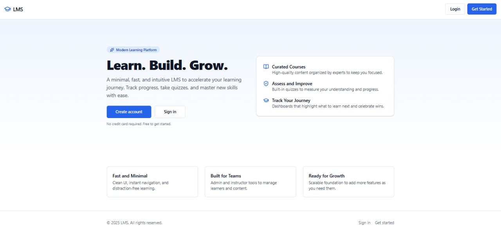
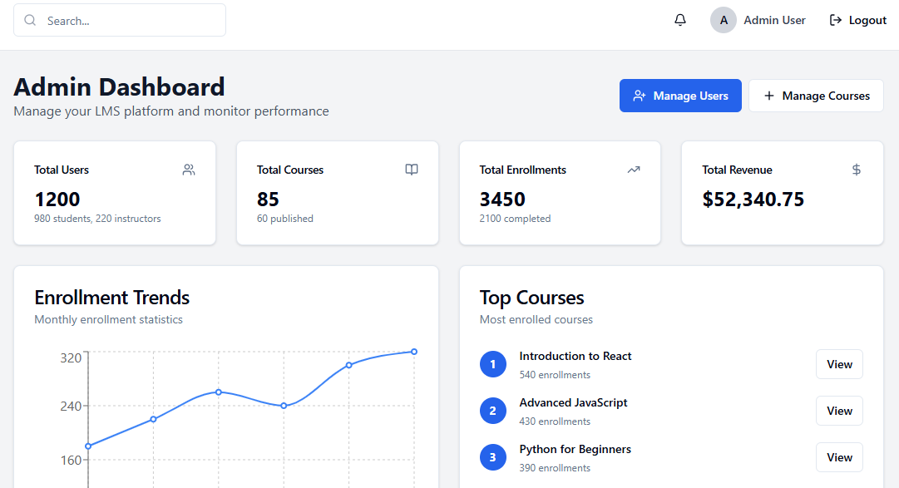

# LMS Platform (Laravel + React)

A full-featured Learning Management System with Laravel API backend, React (Vite) frontend, and modern deployment architecture.

## 🚀 Quick Deploy

[](https://render.com/deploy?repo=https://github.com/saud06/lms-platform)

**Architecture**: Render Docker + Railway MySQL
 


> An intentionally minimal LMS starter that demonstrates a clean Laravel API, a Vite-powered React UI, and a straightforward Azure DevOps CI configuration — great for portfolios and quick demos.

---

## Stack

- Backend: Laravel 10 (PHP 8.2), Composer
- Frontend: React 18 + Vite (JavaScript)
- CI: Azure DevOps Pipelines (`azure-pipelines.yml`)

## Run locally (Windows)

Option A — Quick script

1. Install: PHP 8.2+, Composer, Node.js 18+
2. In PowerShell, run:
```pwsh
./start-local.ps1
```
This will install deps and start: Laravel at http://127.0.0.1:8000 and Vite at http://127.0.0.1:3000.

Option B — Manual

Backend
```pwsh
cd backend
composer install
copy .env.example .env
php artisan key:generate
php artisan serve --host=127.0.0.1 --port=8000
```

Frontend (new terminal)
```pwsh
cd frontend
npm install
npm run dev
```

## Verify

- API: `GET http://127.0.0.1:8000/api/test` returns a small JSON payload.
- UI: Open http://127.0.0.1:3000 — it calls `/api/test` via Vite proxy.

## Azure DevOps CI

The pipeline builds backend and frontend (no deploy): see `azure-pipelines.yml`.

## Notes (AI assistance)

Used GitHub Copilot and Sweep AI to speed up scaffolding, small code snippets, and review suggestions.

## Project goal

Keep it fresh, minimal, and focused on the title: Laravel + React + Azure DevOps.

---

## 🚀 Features

- **Minimal API** — Simple health endpoint (`/api/test`) and demo course progress route.
- **React + Vite Frontend** — Lightweight UI that calls the API via Vite proxy.
- **Azure DevOps CI** — Single pipeline to install, build, and run checks for backend and frontend.
- **Windows-first DX** — `start-local.ps1` to bootstrap quickly on Windows.

---

## 🧩 Tech Stack

| Layer     | Technology               |
|-----------|--------------------------|
| Backend   | Laravel 10 (PHP 8.2)     |
| Frontend  | React 18 + Vite          |
| CI        | Azure DevOps Pipelines   |
| Package   | Composer (PHP), npm (JS) |

---

## 📦 Installation

```bash
git clone https://github.com/saud06/lms-platform.git
cd lms-platform
```

Backend
```bash
cd backend
composer install
copy .env.example .env   # PowerShell: copy .env.example .env
php artisan key:generate
php artisan serve --host=127.0.0.1 --port=8000
```

Frontend (new terminal)
```bash
cd frontend
npm install
npm run dev
```

---

## 🖥️ Usage

### Verify Endpoints

- API health
```bash
curl http://127.0.0.1:8000/api/test
```

- React dev server
Open http://127.0.0.1:3000 — the UI fetches from `/api/test` via the Vite dev proxy.

### Example API Response

```json
{
  "message": "API is working!",
  "timestamp": "2025-01-01T12:00:00Z"
}
```

---

## 🧪 Azure DevOps CI

This repo includes a minimal pipeline at `azure-pipelines.yml` that:

- Installs PHP/Composer deps and runs basic Laravel tasks
- Installs Node deps and builds the frontend

Trigger: pushes to `main`.

---

## 📚 API Overview (Starter)

- `GET /api/test` — Returns a small JSON payload with a message and timestamp.
- `GET /api/student/courses/{courseId}/progress` — Example route for demo student progress.

---

## 📸 Screenshots

**Landing Page**



**Admin Dashboard**



---

## 💡 Why I Built This

> As a Master's student in Web & Data Science with 2.5+ years in software development, I wanted a clean, production-like template that highlights **web engineering fundamentals**: API design, frontend integration, and CI, without over-engineering.

---

## 📬 Contact

* **GitHub**: [saud06](https://github.com/saud06)
* **LinkedIn**: [Saud M.](https://linkedin.com/in/saud06)
* **Email**: [saud.mn6@gmail.com](mailto:saud.mn6@gmail.com)

